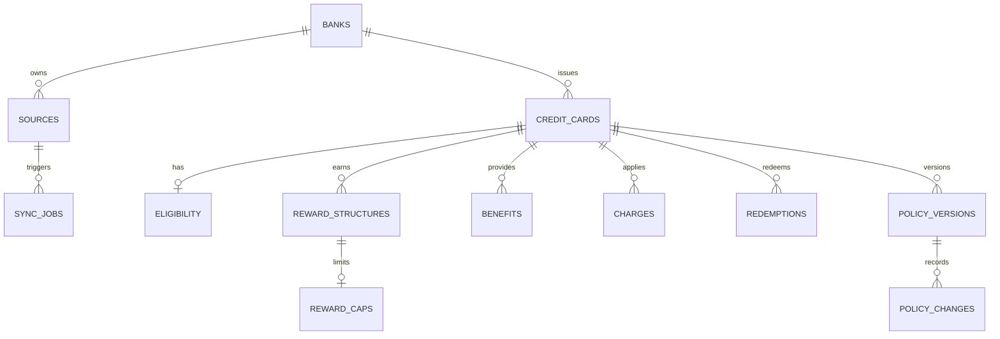

# CardIntel database schema — Sprint 1

This schema stores the card catalogue as structured, versioned data. A policy is never overwritten: each captured policy is stored as a new `policy_versions` record, with its individual differences in `policy_changes`.

## Core tables

| Table | Purpose | Key relationship |
| --- | --- | --- |
| `banks` | Card issuer details | One bank issues many cards. |
| `credit_cards` | The catalogue’s primary card record | Belongs to one bank. |
| `eligibility` | Salary, employment, age, ITR, and score requirements | One optional record per card. |
| `reward_structures` | Category-level earn rules | Many per card. |
| `reward_caps` | Monthly, quarterly, or annual reward limits | One optional cap per reward rule. |
| `benefits` | Lounge, movies, golf, insurance, and similar perks | Many per card. |
| `charges` | Late fees, forex, cash withdrawal, finance charges | Many per card. |
| `redemptions` | Reward conversion and minimum-points rules | Many per card. |
| `policy_versions` | Immutable snapshots of card policies | Many per card, version-numbered. |
| `policy_changes` | Human-readable old-to-new policy differences | Many per policy version. |
| `sources` | Official bank pages, terms, and PDFs to monitor | Many per bank. |
| `sync_jobs` | Execution history for scheduled/manual source syncs | Optionally belongs to a source. |
| `users` | Future identity and basic profile data | Kept separate from preferences and history. |

## Intentional boundaries

- User preferences, saved cards, bookmarks, and recommendation history are separate future tables; they do not belong on `users`.
- `policy_versions.document_hash` identifies the source document captured at that point in time.
- `policy_changes.field_name`, `old_value`, and `new_value` support the UI’s old-to-new comparison view.
- `sources` remain bank-owned because one official document can describe multiple cards. `policy_versions.source_url` preserves the exact URL used for each historical snapshot.
